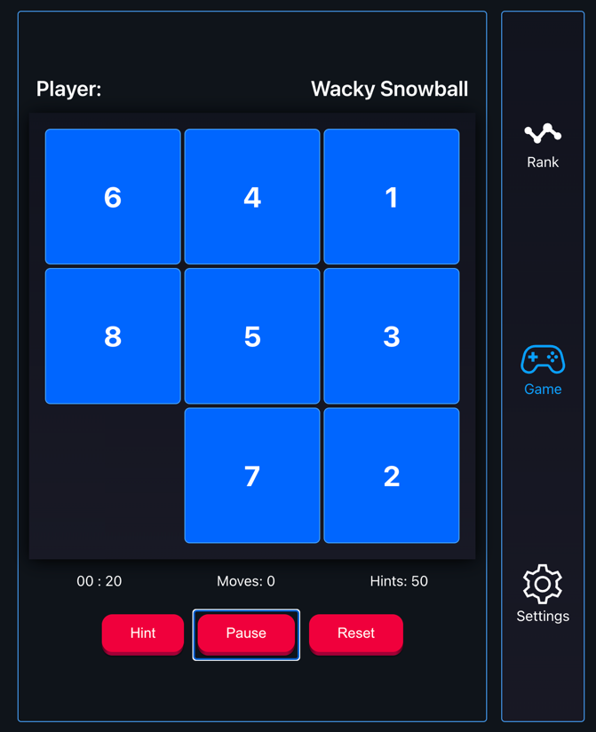

# Miyagi 

A classic puzzle sliding game

## How to play

The goal of the game is to move the tiles around the board to match the goal state. The twist is that you can only move tiles that are adjacent to the empty space.

Check out the [demo](https://miyagi-privilegemendes.vercel.app)!

## Controls
| Hint | Play/Pause | Reset |
| --- | --- | --- |

| Control    | *Description*                                                              |
|------------|----------------------------------------------------------------------------|
| Play/Pause | *Pauses the game*                                                          |
| Reset      | *Resets the game to the initial state*                                     |
| Hint       | *Generates a limited amount of hints one at a time for the current puzzle* |

## Statistics
| Statistic   | *Description*                                     |
|-------------|---------------------------------------------------|
| Time        | *The time it took to solve the puzzle*            |
| Moves       | *The number of moves it took to solve the puzzle* |
| Hints       | *The number of hints used to solve the puzzle*    |

## Roadmap
- [x] Add a difficulty setting (3x3, 4x4, 5x5, 6x6)
- [x] Add a leaderboard (Currently stored in local storage)
- [x] Add a timer
- [x] Add a move counter
- [x] Add a hint counter (Currently only supports 3x3 puzzles)
- [ ] Add a theme selector
- [ ] Add a sound effect
- [ ] Add a music player
- [x] Add a settings menu
- [ ] Add a tutorial
- [ ] Add a help menu
- [x] Add a credits menu

## Puzzle Solver

The puzzle solver uses A* search to find the optimal solution to the puzzle. The heuristic used is the Manhattan distance. This currently only supports 3x3 puzzles.
