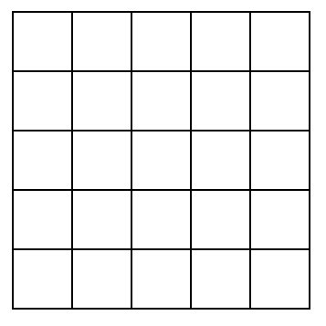

# Welcome to the Miyagi, Puzzle Solver Game! 🎉

This is a fun and challenging game that involves sliding tiles around on a NxN grid to solve a puzzle.
The goal is to rearrange the tiles so that they are in the correct order, which is typically a numbered sequence from 1 to 8,
with an empty space in the bottom right corner.

## How to Play 🤾‍♀️
To play the game, simply click and drag a tile to slide it into the empty space. You can only slide tiles that are adjacent to the empty space,
and you cannot move the empty space itself. Your goal is to use these movements to rearrange the tiles until they are in the correct order.

The game can be quite challenging, but don't worry! You can always hit the "reset" or "hint" button to start over if you get stuck.
You can also time yourself to see how quickly you can solve the puzzle, and try to beat your own record.

So go ahead and give the 3x3 puzzle slider game a try!
It's a great way to test your problem-solving skills and have some fun at the same time.

## Tricks to solving any size Puzzles

So the first thing you’re going to one to do is to solve the first two pieces on the top left. Let's use a 4x4 for example:

1. Solve the top corner (green row)
2. Solve the left corner (green column)
3. Repeat steps 1 and 2 until the puzzle size is decreased to 3×3 (blue)
4. Solve the top corner only (purple)
5. Solve the remaining 3×2 puzzle (pink)

To move a piece to any position the easiest way is to:

1. Put the blank square at the target position
2. Move your piece in the target direction by moving all the pieces one square forward
3. Put the blank square ahead of your piece again by revolving the pieces around your target piece
4. Repeat steps 2 and 3 until your piece reaches its target

And that is how you solve a slide puzzle ! Good luck! 💪
